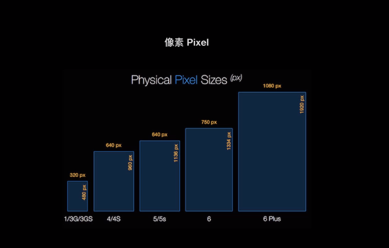
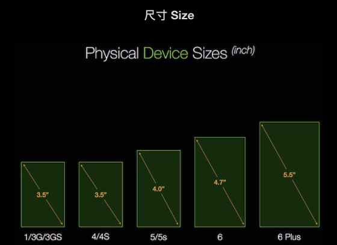
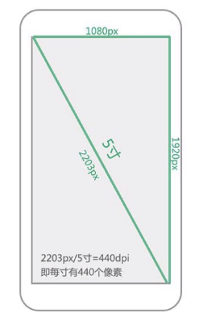
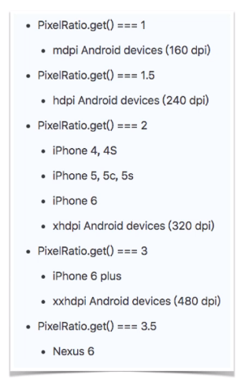
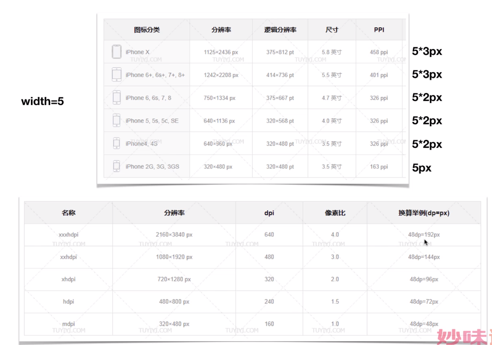

# **屏幕和单位**

## 一、DPI和PPI
### 1、DPI(android)
> Dots Per Inch(每英寸存放多少个点)

### 2、PPI(ios)
> Pixels Per Inch(每英寸存放多少个像素)

## 二、像素
### 1、分辨率(1080px × 1920px)

### 2、尺寸(size)
> 屏幕对角线的长度

### 3、如何计算dpi(android)和ppi(ios)

### 4、获取当前屏幕的像素比PixelRatio.get()

### 5、设备图解
